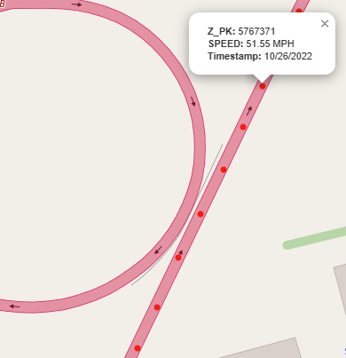
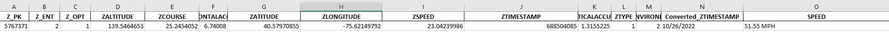

# iOS Mapper Tool

The iOS Mapper Tool is designed to help visually analyze data from the iOS `com.apple.routined` caches database, specifically focusing on the `ZRTCLLOCATIONMO` table.

This tool can be especially valuable in a visual presentation format or to narrow down larger data sets:

- Visually depict location data on an interactive map
- Present a clear user friendly map
- Generate a formatted Excel spreadsheet with readable timestamps and speeds

---

## Features

User-friendly interface  
Converts iOS Apple Absolute Time to readable timestamps  
Converts speeds from meters per second to miles per hour (MPH)  
Sorts data for easy review  
Generates an interactive HTML map  
Saves output files for documentation  
Available as:
- A Python script
- A compiled Windows executable (.exe)
    - [.Exe is under Releases](https://github.com/ClassEuclid/IOS-Mapper-Tool/releases/tag/v2.3.0)

---

## Example Outputs

### Interactive Map

### Formatted Excel Spreadsheet

---

## Use Case

This tool is designed to transform raw iOS location artifacts into clear, understandable visualizations and reports.

It’s especially useful where clear visuals help explain complex technical data to non-technical audiences.

---

## Forensic Disclaimer

> **IMPORTANT:**  
> Always independently validate and verify your findings.  
> Data artifacts can vary depending on iOS versions, acquisition methods, and software updates.  
> This tool is provided as-is, without warranty, for forensic and educational purposes.

---

## Installation

First, clone or download this repository.

### Install Python Dependencies

If running the Python script:

pip install -r requirements.txt
python ios_mapper_tool.py

## Credits

- The Forensic Scooter (https://theforensicscooter.com/)
- Pandas library
- Folium library
- CustomTkinter library
- openpyxl
